# 3. Create a sample web application using PHP/Python and deploy it on AWS.

**The code folder above contains a simple web application created in Python using the Flask framework.
This document contains the steps you need to follow to deploy the application on an EC2 instance.**

**The application:** The app is a phonebook directory application. It is stores the name, phone number, email addresses of the users' contacts. The application allows the user of the application to add new contact to phonebook, delete contact and lists all contacts in a tabular form.

The application uses the bootstrap library for styling some of the elements of the application such as flash messages in flask. Though your application may be entirely different and may not contain similar libraries used in the app.

## Steps to deploy the application on EC2 instance : 

#### Launching an instance

1. Login to AWS Management console. Select Services -> EC2 under compute.

	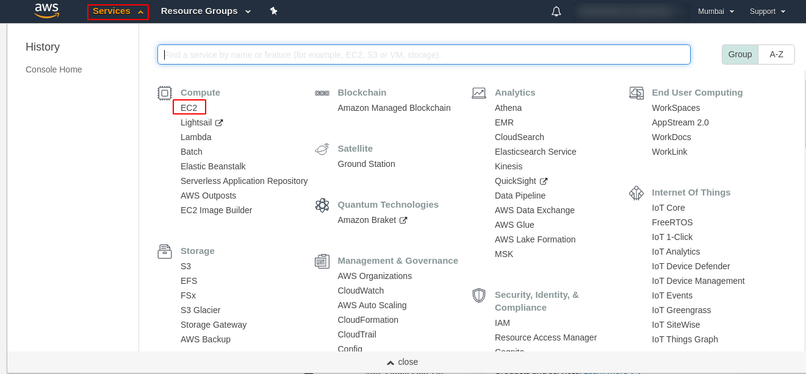

2. Click launch instance

	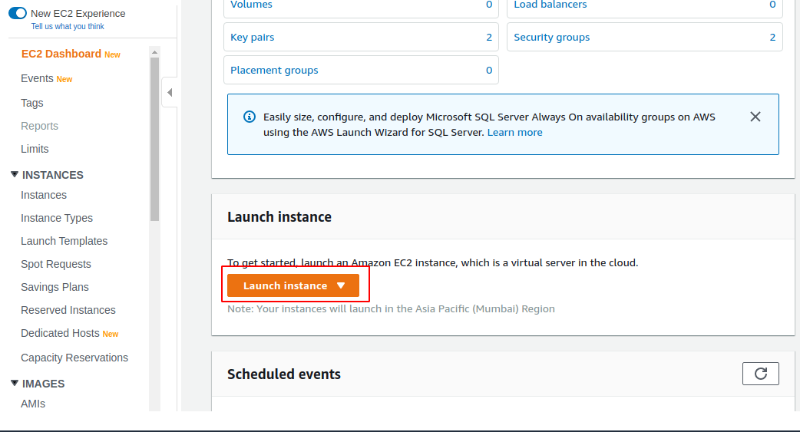

3. Choose Amazon Machine Image (AMI)
	* Choose Ubuntu Server 18.04 AMI

	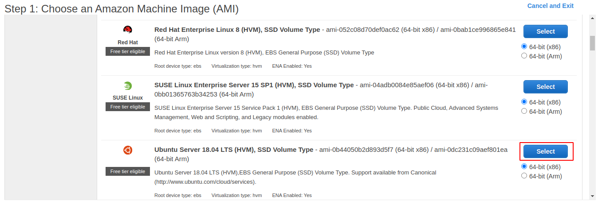

4. Choose Instance Type
	* Choose t2.micro instance type as it is free tier eligible.
	* Click Next
  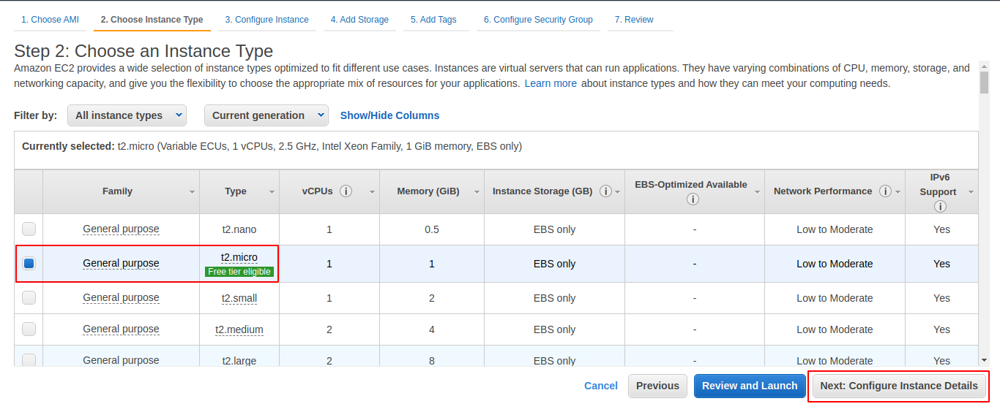

5. Configure instance details
   * Keep everything as default.
   * In the last section i.e. Advanced Details, paste the following script in the user data field.
   	```bash
   	#!/bin/bash
   	sudo apt update
   	```
 	The above code downloads package information from all the pre-configured sources. This will allow us to install packages on the EC2 instance.

  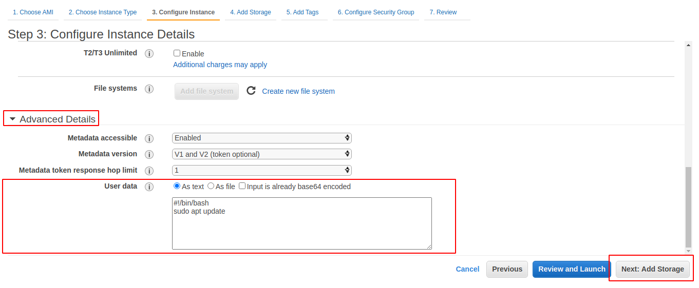

6. Click Next "Add Storage"
	* You can add extra storage to instance if you want. We're not going to any additional storage in this tutorial. Hence Click "Next: Add Tags"

7. Tags are used to label AWS resources for easier identification.
	* Click "Add Tag"
	* Add Tag with name "Name"(without quotes).
	* Value can be any value to help tou identify the instance.
	* Click "Next: Configure Security Groups"
  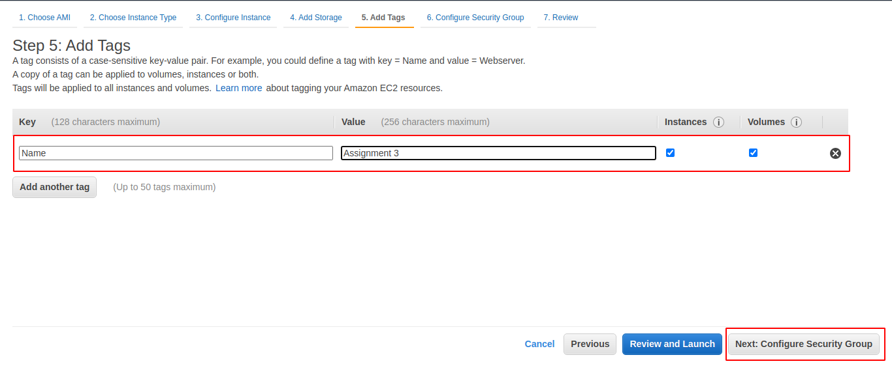

8. In Configure Security groups step, Click "Add Rule"

	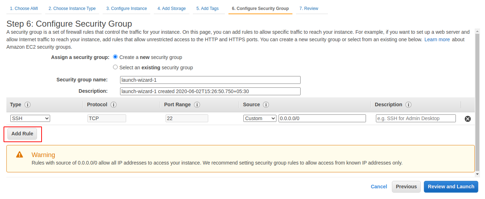

	Next: Select HTTP in the fiest column of the new rule.
	Ensure that the source IP is `0.0.0.0/0, ::/0`. This will open port 80 of the instance allowing our web application to communicate.

	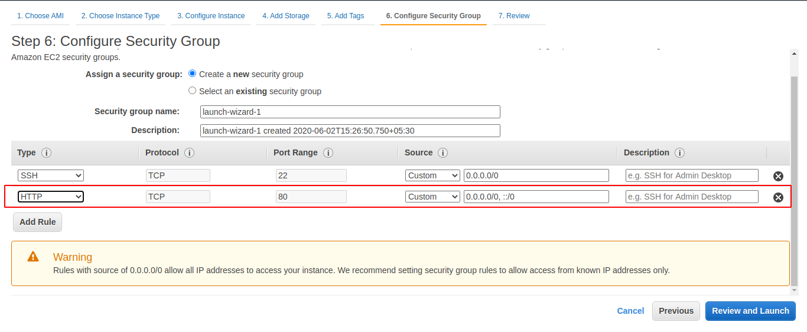

	Finally, Click "Review and Launch" button.

9. Review the details of the instance. Click Launch button.
	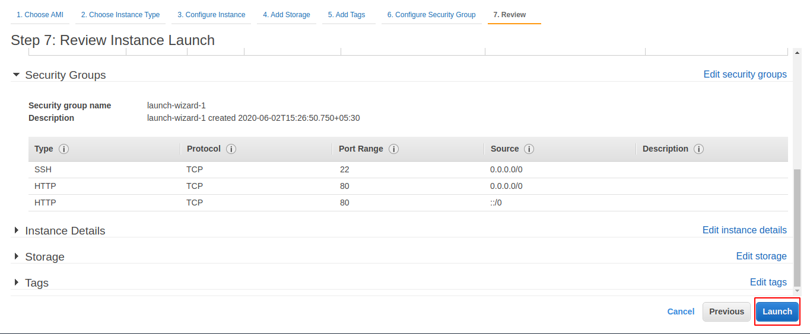

10. Choose an existing key pair if you have one or create a new key pair.
	* Give the key an appropriate name.
	* Download the key.
	* Click Launch Instance button.
	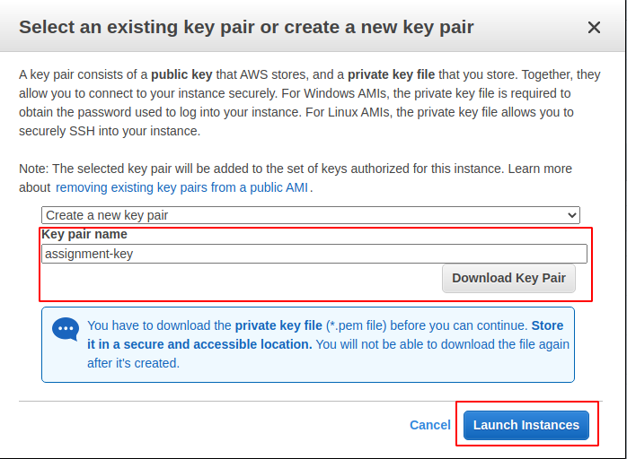

11. Wait for the instance to launch. Scrool down to bottom of screen and click "View Instances" button.
	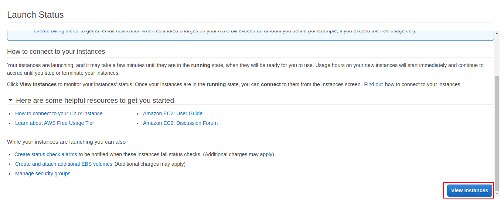

#### Connecting to the instance

1. In the instances tab, select your instance.
	* Click on the connect button.
  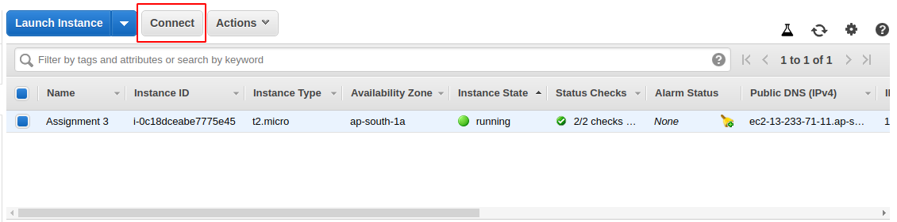

2. Follow the connect instructions.
   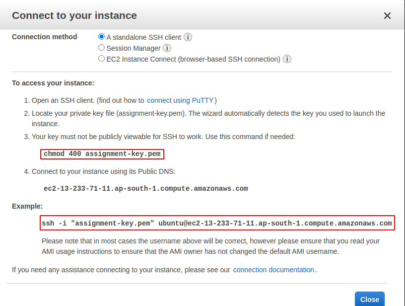

**Note:** Follow steps 3- Linux/Mac

**Note:** Follow steps 4- Windows >= 10. Windows >= 10 users skips step 3

3. Open Terminal in the directory with the downloaded key.
   Type the first command
	 `chmod 400 <YOUR_KEY_NAME>.pem`

4. Run the command 
   
	 `ssh -i "<YOUR_KEY_NAME>.pem" ubuntu@<YOUR_PUBLIC_DNS>`

	 **Note:** the key name and public DNS will be different for each instance. You can get those from the connect tab in AWS console.

5. You will be prompted to confirm connecting. Type "yes" and press enter.
	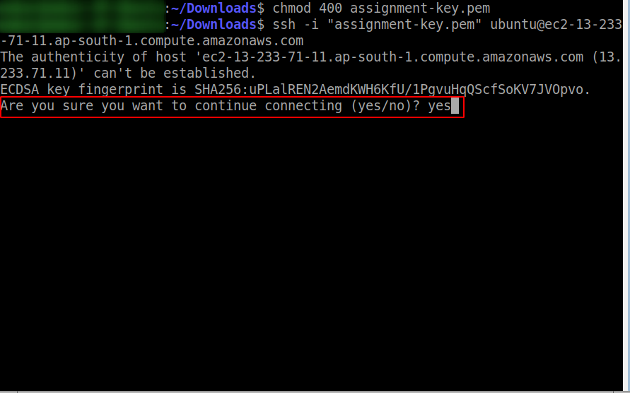

6. After which you computer will try to establish an SSH connection with the instance. On successful connection, your terminal will change to instaces terminal.
	

7. Our application needs python3 to run which is pre-installed on Ubuntu Server 18.04 LTS.
	
	We still need to install pip to install required python dependencies.
	Run `sudo apt install python3-pip` to install pip on the EC2 instance.

8. Clone this Git repository to get the code by running
	`git clone https://github.com/omkarshelar/CSUA32181-VIIT.git`

9. After successful clone of the repository, ensure that the code directory is present by running the `ls` command.
	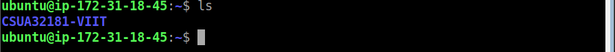

10. Go to the appropriate code directory, in this case running `cd CSUA32181-VIIT/lab-assignment-3/code/`

11. Install requirements by running `pip3 install -r requirements.txt`
  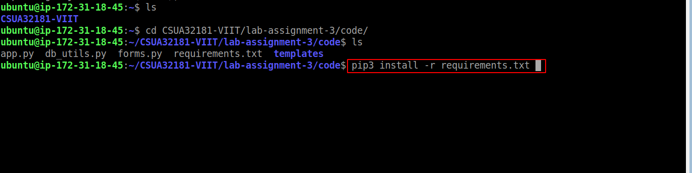

12. Install MySQL by running `sudo apt-get install mysql-server`.

13. Run the command `sudo mysql < sql_script.sql`. This will execute the script in the file `sql_script.sql`. The script creates a new user `test_user` and a database named `phone_directory` and a table within it.
Compare output with the following.

	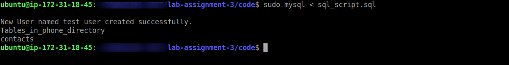

14. Finally, run the application using command `sudo python3 app.py`.
	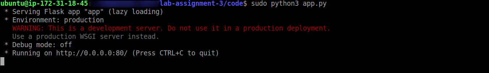

15. Get the public IP of the instance from the AWS console. Go to instaces tab -> Select instance -> get public IPv4 from bottom section(Attached screenshot below).
  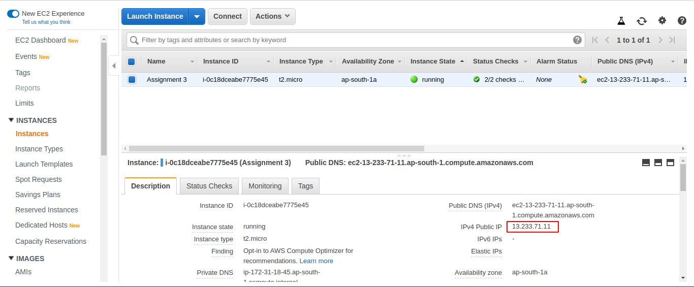

16. Paste the copied IPv4 to new tab and the application will load.
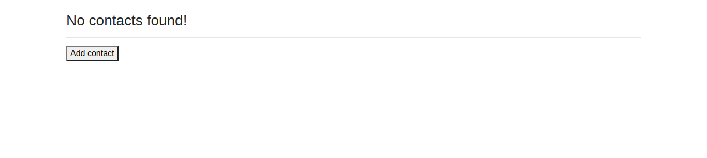
	Try adding a new contact. Deleting a contact etc.
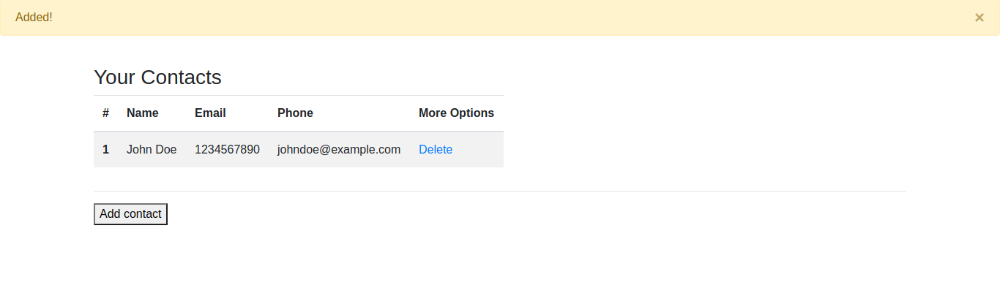

---

End of Assignment-3.

---
Don't forget to [Star](https://github.com/omkarshelar/CSUA32181-VIIT) this repo : 

Created By :
[@omkarshelar](https://github.com/omkarshelar)
and
[@vishal-meshram](https://github.com/vishal-meshram)

Feel free [Fork](https://github.com/omkarshelar/CSUA32181-VIIT/fork) and submit a pull request for corrections/suggestions.